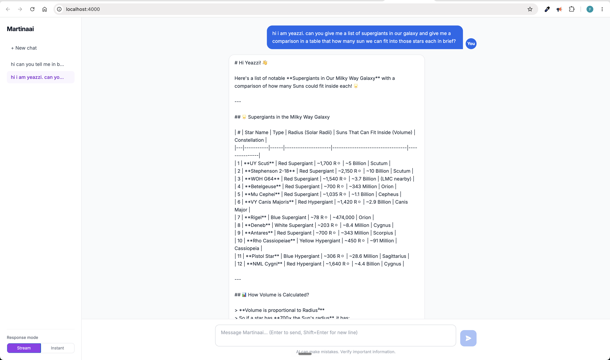
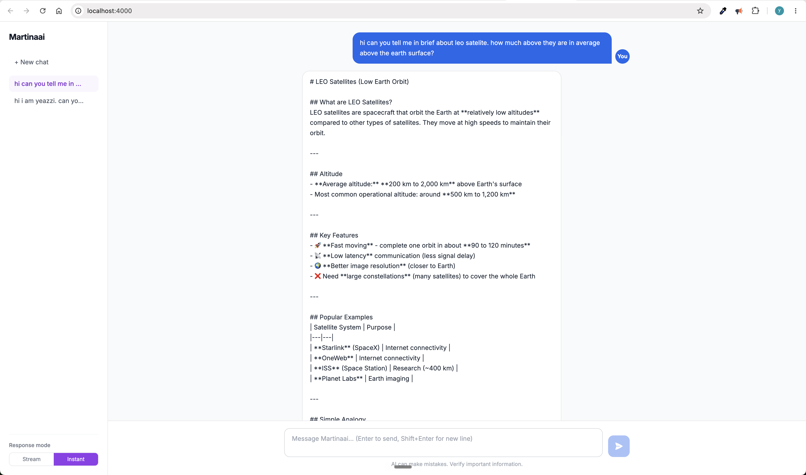

# Martinaai

A production-ready AI chat application built with **FastAPI**, **Claude API**, and **Next.js**. Features real-time streaming responses, multi-turn conversation memory, and a clean ChatGPT-style interface.

**Live demo:** _coming soon_

---

## Screenshots


*Stream mode: tokens appear in real time as Claude generates them*


*Instant mode: full response delivered at once with loading indicator*

---

## Features

- **Streaming responses** — tokens stream to the UI in real time via `StreamingResponse`
- **Instant mode** — full response with animated loading indicator
- **Conversation memory** — full message history sent on every request so Claude remembers context
- **Multi-chat sidebar** — create, switch between, and delete conversations, just like ChatGPT
- **REST API** — clean endpoints for both single-turn and multi-turn use cases
- **Interactive API docs** — Swagger UI at `/docs`, ReDoc at `/redoc`
- **Dockerised** — single `docker compose up` runs the full stack

---

## Tech Stack

| Layer | Technology |
|---|---|
| Backend | Python 3.11, FastAPI, Uvicorn |
| AI | Anthropic Claude API (`claude-sonnet-4-6`) |
| Validation | Pydantic v2 |
| Frontend | Next.js 14, React 18, Tailwind CSS |
| Containerisation | Docker, Docker Compose |
| Deploy | Railway (backend), Vercel (frontend) |

---

## API Endpoints

| Method | Endpoint | Description |
|---|---|---|
| `GET` | `/` | Status check |
| `GET` | `/health` | Version, model, app info |
| `POST` | `/chat` | Single message → full response |
| `POST` | `/chat/stream` | Single message → streaming response |
| `POST` | `/conversation` | Message history → full response |
| `POST` | `/conversation/stream` | Message history → streaming response |

### Example — streaming conversation

```bash
curl -X POST http://localhost:3000/conversation/stream \
  -H "Content-Type: application/json" \
  -d '{
    "messages": [
      {"role": "user", "content": "What is a RAG pipeline?"}
    ],
    "max_tokens": 1024
  }'
```

### Example — health check

```bash
curl http://localhost:3000/health
# {"status":"healthy","app":"Martinaai","version":"1.0.0","model":"claude-sonnet-4-6"}
```

---

## Run Locally

### Prerequisites

- Docker Desktop running
- Claude API key from [console.anthropic.com](https://console.anthropic.com)

### Backend

```bash
cd backend
cp .env.example .env
# Add your CLAUDE_API_KEY to .env
docker compose up --build
```

API runs at `http://localhost:3000` — Swagger UI at `http://localhost:3000/docs`

### Frontend

```bash
cd frontend
docker compose up --build
```

UI runs at `http://localhost:4000`

---

## Project Structure

```
martinaai/
├── backend/
│   ├── config.py          # Settings loaded from .env via pydantic-settings
│   ├── models.py          # Pydantic request/response schemas
│   ├── ai_client.py       # Claude API — streaming + regular, chat + conversation
│   ├── main.py            # FastAPI app, CORS, all routes
│   ├── requirements.txt
│   ├── Dockerfile
│   └── docker-compose.yml
│
└── frontend/
    ├── src/
    │   └── components/
    │       ├── Chat.tsx         # Main layout, state, API calls
    │       ├── MessageBubble.tsx
    │       └── InputBar.tsx
    ├── Dockerfile
    └── docker-compose.yml
```

---

## Environment Variables

```env
CLAUDE_API_KEY=your_api_key_here
MODEL=claude-sonnet-4-6
ALLOWED_ORIGINS=http://localhost:4000
```

---

## Deploy

### Backend → Railway

1. Connect GitHub repo to Railway
2. Set root directory to `backend`
3. Add environment variables: `CLAUDE_API_KEY`, `MODEL`, `ALLOWED_ORIGINS`
4. Railway auto-detects the Dockerfile and deploys

### Frontend → Vercel

1. Connect GitHub repo to Vercel
2. Set root directory to `frontend`
3. Add environment variable: `NEXT_PUBLIC_API_URL=https://your-railway-url.up.railway.app`
4. Deploy

---

## Author

**Yeasir Afgan** — mid-level developer transitioning to AI Engineering.
Building a portfolio of production AI systems targeting UK remote roles.

- GitHub: [github.com/yeasirafgan](https://github.com/yeasirafgan)
